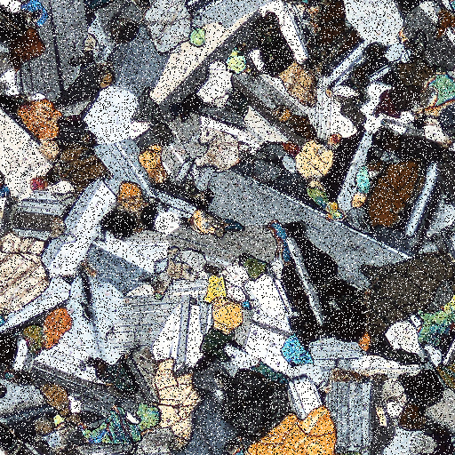
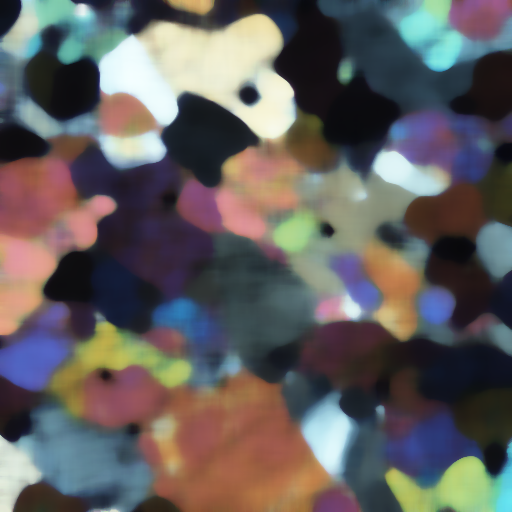
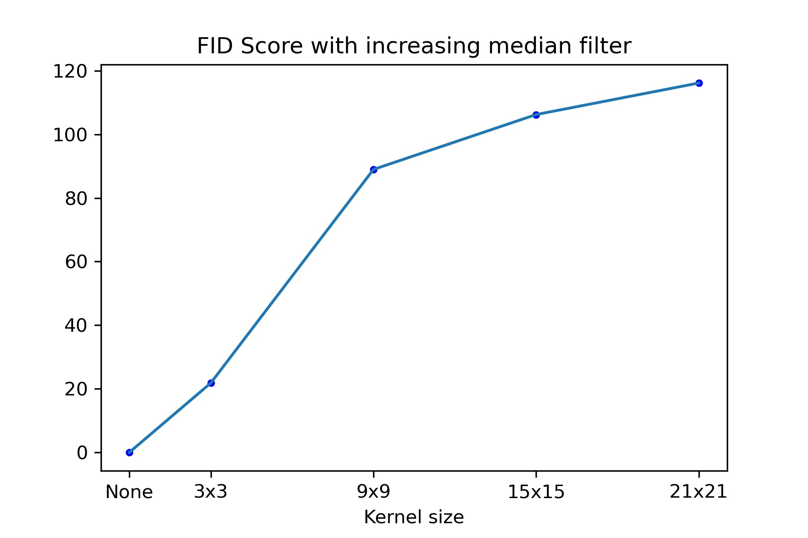

## FID Score calculation for sample thin section images

Using the Fréchet Inception Distance Score to calculate how different two sample folders of images are. Using a folder of images and its noised and filtered equivalents.

Comparison results for the salt and pepper noise.

